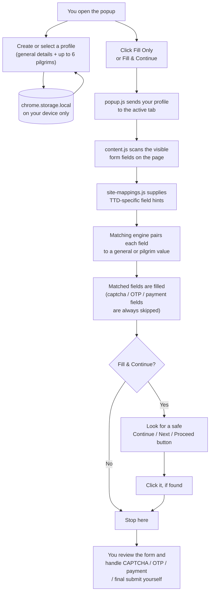

# Pilgrim Form Assistant

A local-only Chrome extension that stores your pilgrim/traveler profiles in
your browser and helps fill in supported TTD (Tirumala Tirupati
Devasthanams) online registration forms in one click.

**Free for everyone.** No cost, no subscription, no ads, no account
required. Developed by **G Naganjaneyulu**.

## What it does

- Saves one or more profiles (your contact details + up to 6 pilgrims per
  profile) entirely in `chrome.storage.local` on your own machine.
- On a supported page, fills matching text/select fields from your saved
  profile using label/placeholder/name-based matching.
- Optionally clicks a clearly-labeled "Continue" / "Next" / "Proceed"
  button after filling, so you can move to the next step of a multi-page
  form without re-typing your details.

## What it deliberately does NOT do

- It does **not** solve or bypass CAPTCHA.
- It does **not** read, fill, or bypass OTP/verification-code fields.
- It does **not** join, skip, or manipulate queues or slot-selection flows.
- It does **not** fill or interact with payment fields, and it never clicks
  a button whose label suggests "Pay", "Submit", "Confirm booking", "Book
  now", or "Order".
- It never submits a form on your behalf - filling only sets field values;
  you always review and submit the form yourself.
- It does **not** send your profile data anywhere. There are no network
  requests in this extension, and no remotely hosted code is loaded or
  executed.

## Supported sites

The extension only runs on:

- `https://*.tirupatibalaji.ap.gov.in/*`
- `https://*.ttdevasthanams.ap.gov.in/*`

It requests no other host permissions and does not use `<all_urls>`.

## How it works

Everything happens on your own device - there is no server or backend
anywhere in this picture.



In short: **profile data never leaves your browser** - the extension only
reads the page's own fields, writes your saved values into them, and
optionally clicks a plain "Continue"-style button. It never touches
CAPTCHA, OTP, queues, payments, or the final submit action.

## Installing in Chrome (download the ZIP, no Chrome Web Store needed)

This extension isn't published on the Chrome Web Store, so there's no
developer-registration fee and no store review to wait for - you load it
straight from a folder on your computer ("Load unpacked"). This is a
completely normal, built-in Chrome feature; it just means Chrome shows a
one-time reminder that developer-mode extensions are installed, which you
can dismiss.

**Step 1 - Download and unzip**

1. Download `pilgrim-form-assistant.zip` (the file you were sent, or
   built locally with `npm run zip` - see below).
2. Find it in your Downloads folder and **unzip it** (right-click →
   "Extract All" on Windows, or double-click on Mac).
3. Move the extracted `pilgrim-form-assistant` folder somewhere permanent
   - e.g. your Documents folder. **Don't delete or move it later** -
   Chrome loads the extension directly from this folder, so if it's
   moved, renamed, or deleted, the extension breaks.

**Step 2 - Load it into Chrome**

4. Open Chrome and go to `chrome://extensions` (type it directly into the
   address bar), or click the puzzle-piece icon in the toolbar → **Manage
   extensions**.
5. Turn on **Developer mode** using the toggle in the top-right corner of
   that page. Three new buttons will appear: "Load unpacked", "Pack
   extension", "Update".
6. Click **Load unpacked**. A file picker opens.
7. Select the `pilgrim-form-assistant` folder you extracted in Step 1 -
   the one that directly contains `manifest.json` - then click **Select**
   / **Open**.
8. Confirm it loaded: "Pilgrim Form Assistant" should now appear as a
   card on the extensions page with its temple icon, version `1.0.0`, and
   no red "Errors" button. If you do see an "Errors" button, click it to
   see what Chrome reported (you may have selected a sub-folder, like
   `icons/`, instead of the top-level folder).

**Step 3 - Pin it and use it**

9. Click the puzzle-piece icon in Chrome's toolbar, find "Pilgrim Form
   Assistant" in the list, and click its pin icon so it sits directly in
   the toolbar.
10. Click the pinned icon to open the popup, create a profile, and fill it
    in under **General** and **Pilgrims**, then click **Save**.
11. Navigate to a supported TTD registration page and click **Fill Only**
    or **Fill & Continue**.

No other software, accounts, or payment are required - just Chrome
itself.

## Building the ZIP yourself

If you have the source folder (not just the ZIP) and Node.js installed:

```bash
npm run zip
```

This shells out to the system `zip` command and produces
`dist/pilgrim-form-assistant.zip`, containing only the extension runtime
files (manifest, scripts, popup, icons, README, LICENSE) - `store/`,
`.git`, `node_modules`, and `Plan.md` are excluded. It's ready to hand to
anyone to unzip and load per the steps above. `git clone`-ing this repo
works too, for anyone who prefers to load the working-copy folder
directly instead of a ZIP.

**Updating after a new version is released:** repeat Steps 1-2 with the
new ZIP into a fresh folder (or overwrite the old folder's files), then on
`chrome://extensions` click the circular reload icon on the "Pilgrim Form
Assistant" card. Since it isn't on the Chrome Web Store, updates are never
automatic - you have to repeat this manually each time. If a supported TTD
tab was already open, refresh that tab too so it picks up the updated
content script. Your saved profiles are untouched by an update since they
live in `chrome.storage.local`, not in the extension folder.

**Removing it:** on `chrome://extensions`, click **Remove** on the
"Pilgrim Form Assistant" card, or right-click its toolbar icon and choose
**Remove from Chrome**. This deletes its `chrome.storage.local` data
(your saved profiles) as well - export a backup first from **Settings →
Export backup** if you want to keep them.

## Using it

1. Open the extension popup and create a profile (**New**) under the
   profile bar, or select an existing one.
2. Fill in **General Details** (email, mobile, city, state, country, PIN)
   and add up to 6 people under **Pilgrims**.
3. Click **Save** to persist the profile.
4. Navigate to a supported TTD registration form.
5. Click **Fill Only** to fill the visible fields, or **Fill & Continue**
   to fill and then click a safe "Continue"/"Next"/"Proceed" button if one
   is present. CAPTCHA, OTP, queue, slot-selection, and payment steps are
   always left for you to complete manually.

## Data & privacy

All profile data is stored using `chrome.storage.local`, scoped to your
browser profile on your own device. Nothing is transmitted to any server -
this extension makes no network requests at all. Use **Settings → Export
backup** to download a JSON copy of your profiles, and **Import backup** to
restore it (e.g. after reinstalling the extension or moving to another
computer). Imported files are validated for shape before being loaded.

## Project layout

```
pilgrim-form-assistant/
├── manifest.json       # MV3 manifest, minimal permissions
├── popup.html/.css/.js # Profile management + fill-trigger UI
├── content.js          # Generic, site-agnostic form-filling engine
├── site-mappings.js    # TTD-site-specific keyword hints (kept separate
│                        # from the generic engine in content.js)
├── background.js       # No-op service worker (required by MV3), no network
├── icons/               # Extension icons (temple.png source + generated sizes)
├── scripts/build-zip.js # Dev-only packaging script
└── store/               # Chrome Web Store listing draft
```

Website-specific knowledge (TTD form terminology such as "devotee name",
"aadhar number", etc.) lives only in `site-mappings.js`. `content.js`
contains no site-specific selectors or logic, so new TTD form variants can
be supported by extending `site-mappings.js` alone.

## Screenshots

Add real screenshots to `store/screenshots/` before publishing to the
Chrome Web Store.

## Developer

Developed by **G Naganjaneyulu**.

## Cost

**This extension is completely free for everyone.** There's no purchase,
subscription, ad, or account required to use any part of it - saving
profiles, filling forms, and exporting/importing backups are all free,
forever.

## License

MIT - see [LICENSE](LICENSE). Free to use, modify, and share.
