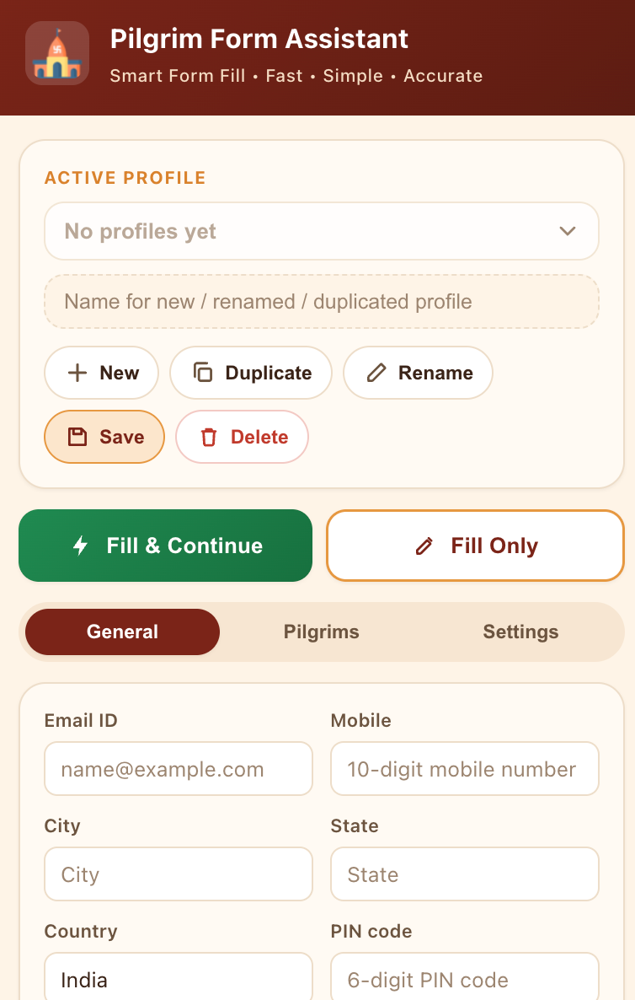
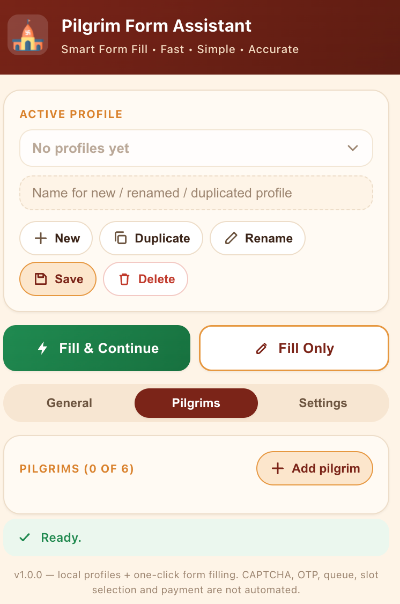
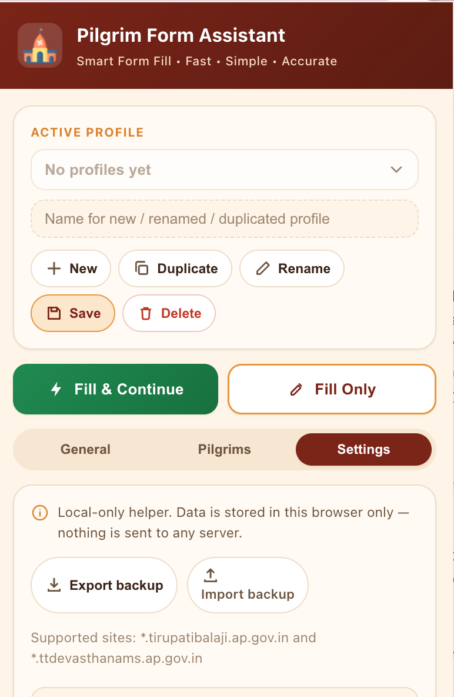
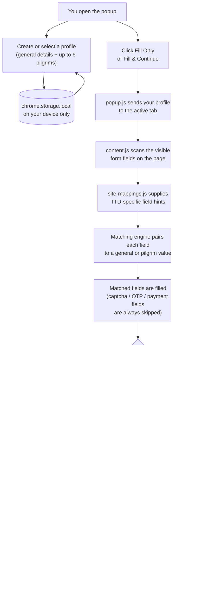

# Pilgrim Form Assistant

A local-only browser extension (Chrome, Edge, Firefox, and other
Chromium/Gecko browsers) that stores your pilgrim/traveler profiles in
your browser and helps fill in supported TTD (Tirumala Tirupati
Devasthanams) online registration forms in one click.

**Free for everyone.** No cost, no subscription, no ads, no account
required. 

<table>
<tr>
<td></td>
<td></td>
<td></td>
</tr>
</table>

## Install in Chrome/Edge (2 minutes, no store needed)

1. Go to **[the latest release](https://github.com/GudditiN/pilgrim-form-assistant/releases/tag/v1.0.0)** and download `pilgrim-form-assistant.zip` from **Assets**.
2. **Unzip it** somewhere permanent (e.g. your Documents folder) - don't delete this folder afterwards.
3. Open `chrome://extensions` and turn on **Developer mode** (toggle, top-right).
4. Click **Load unpacked** and select the unzipped `pilgrim-form-assistant` folder.
5. Pin it from the toolbar's puzzle-piece icon - done!

No account, payment, or Chrome Web Store listing required.
*(Using Firefox, building the zip yourself, or something not working? See [full instructions](#installing-in-chrome-download-the-zip-no-chrome-web-store-needed) below.)*

## What it does

- Saves one or more profiles (your contact details + up to 6 pilgrims per
  profile) entirely in `chrome.storage.local` on your own machine.
- On a supported page, fills matching text/select fields from your saved
  profile using label/placeholder/name-based matching.
- Optionally clicks a clearly-labeled "Continue" / "Next" / "Proceed"
  button after filling, so you can move to the next step of a multi-page
  form without re-typing your details.

## What it deliberately does NOT do

- It does **not** solve or bypass CAPTCHA.
- It does **not** read, fill, or bypass OTP/verification-code fields.
- It does **not** join, skip, or manipulate queues or slot-selection flows.
- It does **not** fill or interact with payment fields, and it never clicks
  a button whose label suggests "Pay", "Submit", "Confirm booking", "Book
  now", or "Order".
- It never submits a form on your behalf - filling only sets field values;
  you always review and submit the form yourself.
- It does **not** send your profile data anywhere. There are no network
  requests in this extension, and no remotely hosted code is loaded or
  executed.

## Supported sites

The extension only runs on:

- `https://*.tirupatibalaji.ap.gov.in/*`
- `https://*.ttdevasthanams.ap.gov.in/*`

It requests no other host permissions and does not use `<all_urls>`.

## How it works

Everything happens on your own device - there is no server or backend
anywhere in this picture.



In short: **profile data never leaves your browser** - the extension only
reads the page's own fields, writes your saved values into them, and
optionally clicks a plain "Continue"-style button. It never touches
CAPTCHA, OTP, queues, payments, or the final submit action.

## Installing in Chrome (download the ZIP, no Chrome Web Store needed)

This extension isn't published on the Chrome Web Store, so there's no
developer-registration fee and no store review to wait for - you load it
straight from a folder on your computer ("Load unpacked"). This is a
completely normal, built-in Chrome feature; it just means Chrome shows a
one-time reminder that developer-mode extensions are installed, which you
can dismiss.

**Step 1 - Download and unzip**

1. Download `pilgrim-form-assistant.zip` (the file you were sent, or
   built locally with `npm run zip` - see below).
2. Find it in your Downloads folder and **unzip it** (right-click →
   "Extract All" on Windows, or double-click on Mac).
3. Move the extracted `pilgrim-form-assistant` folder somewhere permanent
   - e.g. your Documents folder. **Don't delete or move it later** -
   Chrome loads the extension directly from this folder, so if it's
   moved, renamed, or deleted, the extension breaks.

**Step 2 - Load it into Chrome**

4. Open Chrome and go to `chrome://extensions` (type it directly into the
   address bar), or click the puzzle-piece icon in the toolbar → **Manage
   extensions**.
5. Turn on **Developer mode** using the toggle in the top-right corner of
   that page. Three new buttons will appear: "Load unpacked", "Pack
   extension", "Update".
6. Click **Load unpacked**. A file picker opens.
7. Select the `pilgrim-form-assistant` folder you extracted in Step 1 -
   the one that directly contains `manifest.json` - then click **Select**
   / **Open**.
8. Confirm it loaded: "Pilgrim Form Assistant" should now appear as a
   card on the extensions page with its temple icon, version `1.0.0`, and
   no red "Errors" button. If you do see an "Errors" button, click it to
   see what Chrome reported (you may have selected a sub-folder, like
   `icons/`, instead of the top-level folder).

**Step 3 - Pin it and use it**

9. Click the puzzle-piece icon in Chrome's toolbar, find "Pilgrim Form
   Assistant" in the list, and click its pin icon so it sits directly in
   the toolbar.
10. Click the pinned icon to open the popup, create a profile, and fill it
    in under **General** and **Pilgrims**, then click **Save**.
11. Navigate to a supported TTD registration page and click **Fill Only**
    or **Fill & Continue**.


No other software, accounts, or payment are required - just Chrome
itself.

## Building the ZIP yourself

If you have the source folder (not just the ZIP) and Node.js installed:

```bash
npm run zip
```

This shells out to the system `zip` command and produces
`dist/pilgrim-form-assistant.zip`, containing only the extension runtime
files (manifest, scripts, popup, icons, README, LICENSE) - `store/`,
`.git`, `node_modules`, and `Plan.md` are excluded. It's ready to hand to
anyone to unzip and load per the steps above. `git clone`-ing this repo
works too, for anyone who prefers to load the working-copy folder
directly instead of a ZIP.

**Updating after a new version is released:** repeat Steps 1-2 with the
new ZIP into a fresh folder (or overwrite the old folder's files), then on
`chrome://extensions` click the circular reload icon on the "Pilgrim Form
Assistant" card. Since it isn't on the Chrome Web Store, updates are never
automatic - you have to repeat this manually each time. If a supported TTD
tab was already open, refresh that tab too so it picks up the updated
content script. Your saved profiles are untouched by an update since they
live in `chrome.storage.local`, not in the extension folder.

**Removing it:** on `chrome://extensions`, click **Remove** on the
"Pilgrim Form Assistant" card, or right-click its toolbar icon and choose
**Remove from Chrome**. This deletes its `chrome.storage.local` data
(your saved profiles) as well - export a backup first from **Settings →
Export backup** if you want to keep them.

## Installing in Firefox

The same codebase works in Firefox too - `manifest.json` declares both
the Chrome-style (`service_worker`) and Firefox-style (`scripts`)
background configuration, plus the `browser_specific_settings.gecko`
block Firefox needs, so there's no separate Firefox build to maintain.
Requires Firefox 121 or later.

**Temporary load (for trying it out / development):**

1. Download and unzip `pilgrim-form-assistant.zip` (or `git clone` this
   repo) per Steps 1 above.
2. Open `about:debugging#/runtime/this-firefox` in Firefox's address bar.
3. Click **Load Temporary Add-on...**.
4. In the file picker, navigate into the extracted `pilgrim-form-
   assistant` folder and select the `manifest.json` file itself (Firefox
   reads the whole folder from there).
5. It appears in the list as "Pilgrim Form Assistant" - open it from the
   toolbar the same way as in Chrome.

**Note:** a temporary add-on is removed when Firefox closes - you'd have
to reload it each session. For something that persists, either install a
`.xpi` signed by Mozilla (see publishing below) or use **Firefox
Developer Edition** / **Nightly**, which allow permanently installing
unsigned extensions via `xpinstall.signatures.required` in `about:config`
(not recommended for a regular daily-use profile).

## Publishing this extension (free, no store fee either way)

### Chrome/Edge - via GitHub, without the Chrome Web Store's fee

The Chrome Web Store charges a one-time $5 developer registration fee.
The [common, accepted alternative for smaller/personal extensions](https://www.reddit.com/r/chrome_extensions/) is to
skip the store entirely and distribute the zip yourself - which is
exactly what the "Installing in Chrome" section above already supports:

1. Push this repo to a public GitHub repository.
2. Tag a version and push the tag, e.g.:
   ```bash
   git tag v1.0.0
   git push origin v1.0.0
   ```
3. The included GitHub Actions workflow
   (`.github/workflows/release.yml`) automatically runs `npm run zip` and
   attaches `pilgrim-form-assistant.zip` to a new GitHub Release for that
   tag - no local build step needed.
4. Share the release page URL. Anyone can download the zip from it and
   follow "Installing in Chrome" above. Updates work the same way: tag a
   new version, the workflow builds a fresh zip, people re-download it.

(If you'd rather build and attach the zip manually instead of using the
workflow, `npm run zip` + attaching the file to a release via `gh release
create v1.0.0 dist/pilgrim-form-assistant.zip` or the GitHub UI works
just as well.)

### Firefox - via addons.mozilla.org (AMO), completely free

Unlike the Chrome Web Store, Mozilla's add-on store has no listing fee at
all.

1. Build the zip: `npm run zip` (or download the one from a GitHub
   Release above - it's the same file).
2. Create a free Firefox account, then go to
   [addons.mozilla.org's submission page](https://addons.mozilla.org/en-US/developers/addon/submit/upload-listed).
3. Choose **On this site** (a public, listed add-on) and upload
   `dist/pilgrim-form-assistant.zip`.
4. AMO automatically scans the source (it's all plain, readable
   JS/HTML/CSS with no bundler or minifier, which automated review tools
   generally handle well) and either auto-approves or queues a quick
   manual review - either way, there's no fee.
5. Fill in the listing details it asks for (summary, category, etc.) and
   submit. Once approved, Mozilla hosts and signs it, and updates are
   pushed by uploading a new zip with a bumped `version` in
   `manifest.json`.

**One important, one-time decision:** `manifest.json`'s
`browser_specific_settings.gecko.id` (currently set to a placeholder,
`pilgrim-form-assistant@naganjaneyulu.dev`) is what AMO uses to recognize
this as "the same add-on" across versions. Change it to whatever you like
*before* your first submission if you want something different, but
don't change it afterwards - that would make AMO treat a future update as
a brand-new, unrelated add-on.

## Using it

1. Open the extension popup and create a profile (**New**) under the
   profile bar, or select an existing one.
2. Fill in **General Details** (email, mobile, city, state, country, PIN)
   and add up to 6 people under **Pilgrims**.
3. Click **Save** to persist the profile.
4. Navigate to a supported TTD registration form.
5. Click **Fill Only** to fill the visible fields, or **Fill & Continue**
   to fill and then click a safe "Continue"/"Next"/"Proceed" button if one
   is present. CAPTCHA, OTP, queue, slot-selection, and payment steps are
   always left for you to complete manually.

## Data & privacy

All profile data is stored using `chrome.storage.local`, scoped to your
browser profile on your own device. Nothing is transmitted to any server -
this extension makes no network requests at all. Use **Settings → Export
backup** to download a JSON copy of your profiles, and **Import backup** to
restore it (e.g. after reinstalling the extension or moving to another
computer). Imported files are validated for shape before being loaded.

## Project layout

```
pilgrim-form-assistant/
├── manifest.json       # MV3 manifest, minimal permissions, cross-browser
│                        # (Chrome/Edge + Firefox via browser_specific_settings)
├── popup.html/.css/.js # Profile management + fill-trigger UI
├── content.js          # Generic, site-agnostic form-filling engine
├── site-mappings.js    # TTD-site-specific keyword hints (kept separate
│                        # from the generic engine in content.js)
├── background.js       # No-op background script, no network
├── icons/               # Extension icons (temple.png source + generated sizes)
├── scripts/build-zip.js # Dev-only packaging script
├── .github/workflows/release.yml # Builds + attaches the zip to a GitHub
│                                   # Release on each version tag push
└── store/               # Chrome Web Store listing draft
```

Website-specific knowledge (TTD form terminology such as "devotee name",
"aadhar number", etc.) lives only in `site-mappings.js`. `content.js`
contains no site-specific selectors or logic, so new TTD form variants can
be supported by extending `site-mappings.js` alone.

## Local development setup

For anyone who wants to change the code (not just use the built extension)
- e.g. tweaking `site-mappings.js` for a new TTD form, or adjusting the
popup UI.

**Prerequisites:**
- A Chromium browser (Chrome, Edge, Brave, ...) and/or Firefox 121+, for
  loading and testing the extension.
- [Node.js](https://nodejs.org/) - only needed to run `npm run zip`
  (packaging). The extension itself has zero runtime dependencies and
  needs no build step to run.
- `git`, to clone the repo.

**1. Get the code:**

```bash
git clone <this-repo-url>
cd pilgrim-form-assistant
```

(No `npm install` is required - there are no dependencies to install for
the extension itself.)

**2. Load it unpacked, straight from the source folder:**

- **Chrome/Edge:** `chrome://extensions` → enable **Developer mode** →
  **Load unpacked** → select this `pilgrim-form-assistant` folder.
- **Firefox:** `about:debugging#/runtime/this-firefox` → **Load Temporary
  Add-on...** → select `manifest.json` inside this folder.

See "Installing in Chrome" / "Installing in Firefox" above for the full
click-by-click steps - they're the same, just pointed at your working
copy instead of a downloaded ZIP.

**3. Make your changes, then reload to see them:**

- Edit `popup.html`/`popup.css`/`popup.js` for the UI, `content.js` for
  the generic form-filling engine, or `site-mappings.js` for TTD-specific
  keyword hints/selectors.
- After saving, go back to `chrome://extensions` (or
  `about:debugging` in Firefox) and click the reload icon on the
  extension's card. Popup changes (HTML/CSS/JS) apply immediately on next
  open; content-script changes (`content.js`, `site-mappings.js`) also
  need the target TTD tab refreshed, since content scripts only inject on
  page load.
- Check the browser console (on the TTD page, for `content.js`) or the
  popup's own inspector (right-click the popup → **Inspect**, for
  `popup.js`) for errors.

**4. Verify before committing:**

```bash
# manifest.json is valid JSON
node -e "JSON.parse(require('fs').readFileSync('manifest.json','utf8'))"

# every script parses cleanly
node --check popup.js
node --check content.js
node --check background.js
node --check site-mappings.js

# package it, to make sure the build step still works
npm run zip
```

There's no automated test suite in this repo (it's plain, dependency-free
JS with no bundler). The checks above catch syntax errors; actual
form-filling behavior is verified by hand against the real TTD sites, or
with a throwaway Node script using `jsdom` to simulate a page's DOM if you
want to test `content.js`'s matching logic in isolation without a browser.

## Screenshots

All from the actual popup, unpacked and running.

| General Details | Pilgrims | Settings |
| --- | --- | --- |
|  |  |  |

(Also copy these into `store/screenshots/` when submitting to the Chrome
Web Store or AMO listings - those require screenshots uploaded through
each store's own dashboard, not linked from the repo.)

## Developer

Developed by **G Naganjaneyulu**.

## Cost

**This extension is completely free for everyone.** There's no purchase,
subscription, ad, or account required to use any part of it - saving
profiles, filling forms, and exporting/importing backups are all free,
forever.

## License

MIT - see [LICENSE](LICENSE). Free to use, modify, and share.
